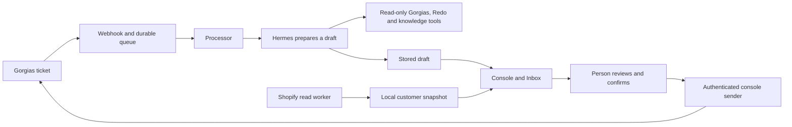

# Buttons Bebe support

This repository receives customer tickets, prepares AI replies, and shows them to
staff at https://support.buttonsbebe.com. A person reviews and confirms every
customer reply. AI and Shopify tools read information only.

Start with [AGENTS.md](AGENTS.md) for the safety rules and current component map.
Use [the document index](docs/README.md) to distinguish current instructions from
historical reports. Repository changes do not establish what production runs.

## How a reply reaches staff



The Inbox starts read-only after every reload. Its optional Read & write switch
lasts 30 minutes and requires confirmation for each reply. Automatic retries of
AI generation can prepare another draft. They never send a customer reply.

## Where the code lives

| Directory | Purpose |
| --- | --- |
| `webhook/` | Ticket intake, SQLite queue, authentication, reviewed human actions |
| `processor/` | Draft generation, bounded retries, read-only recovery, owner alerts |
| `console-src/index.html` | Console page |
| `console-src/inbox2/` | Active Inbox assets, local read API and customer worker |
| `console-src/inbox/` | Required shared projection and Shopify snapshot modules |
| `kb/` | Knowledge search, owner notices, catalog refresh and learning promotion |
| `tools/` | Read-only provider tools, offline gate and operations helpers |
| `kb-admin/`, `whatsapp-connect/` | Knowledge editor and owner alert connection |
| `deploy/` | Source release inventory, approved proxy/unit sources and recovery |
| `testing/` | Synthetic checks and separate live-model quality evaluation |

The public Inbox route is `/inbox/`. The backend's internal name remains
`inbox2`, with `helpdesk-inbox2` on localhost 8767 and
`buttonsbebe-inbox2-shop` for customer enrichment. The existing
`buttonsbebe-inbox-projection.timer` supplies AI snapshots.

## Work locally

Use the synthetic loopback preview. It needs no customer data or credentials.

```sh
python3 skills/buttonsbebe-support-webapp/scripts/serve_inbox_preview.py --port 8878
```

Open http://127.0.0.1:8878/inbox/. Follow
[the project development guide](skills/buttonsbebe-support-webapp/references/development.md)
for the prepared Python environments and component checks. Run
`bash tools/verify_release.sh` before a release.

A passing push to `main` deploys to production. Source deployment assumes a
provisioned host and prepared dependencies. Privileged receiver changes need
separate installation. Use [the source release runbook](deploy/cd/README.md).
The retired Inbox1 installation helper refuses every action, including rollback.

Keep credentials, customer databases, exports, runtime logs, and backups outside
Git. Preserve customer data during source recovery. Do not restore retired Inbox
services or use old setup instructions for the active system.
