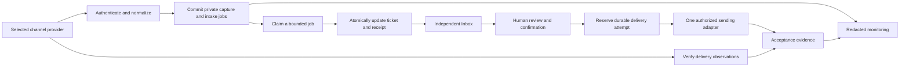

# Email/channel boundary and durable intake (E4)

E4 implements a provider-neutral boundary and tests it with local fakes. The only
adapter is a signed file fixture. There is no network receiver, provider SDK,
SMTP connection, credential loader, background poller, delivery worker, alert
sender or switch that activates any of those. All commands run under intake's
outgoing network/DNS/subprocess denial. Imported history never starts a job.

The production design below is a target for a separately reviewed implementation.
It does not establish real provider compatibility or authorize activation. The
bounded D7 sample and its gaps remain the evidence baseline. E5 covers migration
and cutover; E6 requires exact scope and a new owner instruction.

## Intended production boundaries



In this sandbox, local signed files stand in for the provider/authentication
boundary and SQLite fake dispatch records stand in for sending. The diagram
includes future components; it is not a deployed topology.

| Boundary | Required contract | Current fake proof |
| --- | --- | --- |
| Inbound email | Authenticated channel/account/mailbox, provider event and message IDs, UTC time, sender/recipients, visibility, subject, text, original RFC headers, attachment references, retained source | Signed `offline_replay` body, scoped registered channel, D4 normalizer/threader |
| Other channels | Channel-specific immutable event/message IDs and participants; explicit capability declaration; reviewed normalization and threading rules | Unsupported channels rejected; email rules cannot silently absorb chat/social events |
| Outbound | Human-confirmed frozen recipient/content/version, stable attempt ID and content digest; explicit acceptance/rejection/unknown outcome | D5 review/reserve/fake-dispatch ledger; no autonomous sending jobs |
| Delivery observations | Authenticated receipt tied to account, mailbox, attempt, reviewed digest and transport receipt ID; arrival order cannot erase stronger facts | Signed `offline_receipt` capture and durable observation jobs |
| Staff identity | Stable user ID, current role/session, channel permission, verified audit actor | E2 local scrypt accounts, sessions, roles and review ownership |
| Worker identity | Narrow workload identity, transactional claim token, bounded attempts, revoked ownership on recovery | Local OS operator only, fenced SQLite leases and restore hold |

The selected email vendor, mail domains, inbound mailbox routing, other required
channels and production identity provider are still unspecified. Select them
before implementing a live adapter. For each vendor, verify its current official
raw-signature scheme, replay policy, event IDs, acknowledgement deadline, payload
limits, attachment access, idempotency retention, lookup API and delivery-event
semantics. Use vendor fixtures to run the contract suite, then separately approved
integration tests. Do not assume this fake protocol matches any vendor.

## Authentication design

A future gateway verifies the original bytes before normalizing a payload. Its
route/registration and credential scope determine the channel namespace. The body
cannot choose a different tenant/mailbox. Reject unknown/revoked keys, wrong
signatures, wrong scope, invalid timestamps, malformed/oversized payloads and
unsupported event types. Authenticate redeliveries too. Acknowledge only after
capture and jobs commit; a storage/capacity failure must not acknowledge receipt.
Invalid authenticated batches fail atomically and need operator investigation.

The fake protocol signs a canonical metadata tuple (format, channel, key,
delivery ID, purpose, signing time), a newline and the exact UTF-8 body with
HMAC-SHA256. It accepts a five-minute clock window. Keys are random, generated
inside this workspace, never supplied or printed, and can overlap during rotation
or be revoked immediately. These test keys are stored in the private SQLite DB
and backups; **they must never become production credentials**. Capture verification
on backup accepts historical signatures from now-revoked keys, without granting
those keys new admission rights.

A valid gateway signature proves event provenance, not customer identity or an
email From address. Sender authentication and anti-abuse decisions must use the
selected provider's trusted envelope/authentication results; customer-supplied
headers are untrusted. Sensitive account/order actions still require their own
identity verification. Preserve ambiguous mail for review. Remote HTML and
attachments stay inert; production MIME limits, file quarantine/scanning and
trusted attachment retrieval need separate implementation and tests.

For production staff access, use a chosen OIDC identity provider with MFA, TLS,
secure HttpOnly cookies, short sessions, CSRF protection and explicit role/channel
permissions. Revoke sessions on role changes and recovery; recheck permissions
inside writes. Service credentials must be distinct from staff sessions, held by
the relevant adapter only, and rotated through a secret manager. Queue workers
need ticket/receipt writes, not provider sending credentials. The assistance
service cannot inherit send permissions. E2 is a local identity proof, not this
production authentication deployment.

## Durable queue behavior

Schema 7 adds channel registrations, generated fake keys, signed captures, intake
jobs and receipt observations. Schema-4/5/6 backups remain recognized, and the
schema-6 definition is frozen for historical verification. Earlier proof
workspaces are not opened/migrated during E4's fresh rehearsal.

Admission requires a local file preview digest. It authenticates and validates
before committing capture and all new jobs together. At most 500 events and
20 MiB of body data are accepted per capture; the escaped JSON frame is capped
at 40 MiB. More than 10,000 unfinished/dead jobs refuses a new admission. The
exact same event has one job per channel/kind/event ID across redeliveries;
changed content under the same delivery/event identity is a conflict. Provider
namespaces are distinct, including newly created contact identities.

States are `queued → leased → done`, with `retry` or `dead` on failure. Claims
last 60 seconds, use unpredictable tokens and increment a durable attempt count.
Only the current unexpired token may commit results or failure state. A worker
that loses its lease cannot commit a late result. Expired leases are reclaimable;
three claims exhaust the automatic budget, including process deaths. Transient
failures wait 30 then 120 seconds; invalid content, identity conflicts and
unexpected code failures go directly to `dead`. Worker exception text is never
stored or printed. A storage failure while recording failure leaves the existing
lease to expire.

A single transaction applies the existing D4 identity/threading/reopen rules,
records its deduplication receipt and completes the job. A crash before commit
leaves none of those writes; a lost response after commit leaves all of them.
Historical outgoing/internal echoes remain ignored and saved incoming history
deduplicates against original source identities. Job completion does not call AI,
notify anyone or send a reply. Preview and admission alone do not modify tickets.

Jobs are claimed in admission order among eligible jobs, with at most one active
lease per channel. Another worker cannot overtake a currently processing parent;
other channels remain claimable. Delayed/retrying work can be overtaken.
Unknown/out-of-order parents remain in review; this design does
not invent ordering, auto-merge later parents or infer threads from subject text.
SQLite serializes local writes. Multi-node throughput, provider retry storms,
queue retention and database growth are production load/operations gates, not
claims established by these tests.

A dead job needs a fresh inspection digest and recorded operator reason before
its same immutable payload receives a new bounded budget. This is an **intake**
retry only. A genuinely invalid/conflicting event will fail again; correcting the
source requires separate reviewed evidence, not editing its capture or suppressing
the conflict. No monitor or timer silently requeues dead work.

## Acceptance and delivery reconciliation

D5's historical `simulated_delivered` state means the local fake **accepted** the
reviewed message and recorded one simulated outgoing row. It does not prove
recipient delivery. E4 keeps separate observations: `accepted`, `deferred`,
`delivered`, `bounced`, `complained`. Health reports accepted/deferred until a
stronger fact exists. Late accepted/deferred observations cannot downgrade a
terminal fact. Delivered plus bounced produces `conflict` regardless of arrival
order; complaints also need staff attention. All original observations remain.

A receipt job requires matching durable fake acceptance, reviewed digest,
transport receipt, account and mailbox; a missing dispatch can retry its read
briefly, then becomes dead. A forged/wrong/unknown acceptance cannot manufacture
an outgoing message. Observations cannot dispatch, authorize a retry, reopen a
review or clear D5 uncertainty. A person can still explicitly reconcile the
original attempt against its durable fake evidence. Accepted-with-lost-response
recovers one outgoing row; missing/unknown evidence remains blocked. A bounce
is not proof that a previously accepted submission is safe to resubmit.

For a future live adapter, persist the attempt before submission. Use a provider
idempotency key only after its exact guarantees/retention are verified. Treat
connection loss after possible acceptance as unknown. Reconcile by authenticated
receipt or authoritative lookup tied to that attempt, never by subject/body
search or absence from a list. If proof is unavailable, hold for staff review.
No automatic uncertain resend is allowed. Exactly-once delivery across external
systems is not claimed. One active sending owner and recovery fencing across
hosts are required before cutover.

## Local monitoring and recovery

`jobs-health` is read-only after opening the current workspace schema. It returns
counts, oldest pending age, worker-invocation age, expired leases, redacted error
codes, unresolved attempts and receipt outcomes. It contains no ticket IDs,
addresses, subjects, bodies or exception strings. Attention signals include a
restore hold, dead jobs, expired leases, backlog over five minutes, a stale worker
with waiting work, uncertainty, bounces, complaints and conflicting receipts.
These are explicit local reports, not active alerts. Thresholds exercise the
monitoring contract; production SLOs require measured traffic and owner review.
No background heartbeat, telemetry or alert destination is installed.

A production monitor should independently check receiver health, signature
rejection rate, storage capacity/commit errors, arrival-to-ticket lag, retry/dead
counts, workload heartbeat, unresolved submission age, delivery problems and
verified backup age. Route minimal redacted alerts to an authorized operator
channel only after E6; define acknowledgement/escalation ownership and test the
monitor's own failure separately. Local fake tests do not prove external alerts,
mail reputation or deliverability.

A schema-7 backup validates signed captures, payload digests, namespace bindings,
leases, capture-to-job completeness, completed jobs and their atomic receipts/
observations alongside D6's existing file and ledger checks. Completed incoming
results must still have the correct native message/ticket, unchanged message
content and retained replay/import provenance; deduplication receipts alone do
not prove that mail survived. Restore creates a new workspace, revokes staff
sessions and all fake signing keys, changes the review generation, invalidates
outstanding claims and places **admission and job processing on hold**. A local
operator inspects counts/integrity and submits the current recovery-plan digest
to resume fake jobs. Captured jobs retain their original authenticated evidence;
new admission needs newly generated fake keys. An old lease cannot act after
resume. Completed jobs stay completed, and uncertain replies stay uncertain.
Older restored schemas also receive the hold, enforced when upgraded to E4.

Before future production recovery, isolate the failed owner, restore and verify
private encrypted/offsite checkpoints, revoke sessions/credentials, reconcile
in-flight submissions with the selected provider and prove the previous worker
cannot submit. Agree RPO/RTO, evidence retention and audit ownership. The local
hold does not fence another machine or reconcile activity after the checkpoint.
Those production steps remain unimplemented and feed E5/E6.

## Exercise the local contract

Use only a new workspace and synthetic or explicitly saved offline data. This
example uses the existing synthetic replay fixture; placeholders are outputs from
the preceding command. No secret is passed on the command line.

```bash
python3 -m intake --workspace channel-demo channel-create --account synthetic-replay --mailbox support@example.test --provider simulation
python3 -m intake --workspace channel-demo channel-key --channel-id CHANNEL_ID
python3 -m intake --workspace channel-demo channel-fixture intake/fixtures/replay-synthetic.json --key-id KEY_ID --name signed.json
python3 -m intake --workspace channel-demo channel-preview intake/.local/channel-demo/signed.json
python3 -m intake --workspace channel-demo channel-enqueue intake/.local/channel-demo/signed.json --expected-digest PREVIEW_DIGEST
python3 -m intake --workspace channel-demo jobs-run --limit 100
python3 -m intake --workspace channel-demo jobs-health
```

Use the fixture's exact account/mailbox/provider registration. Signing is not
admission: wrong namespaces still fail even with a valid signature. An expired
fixture must be explicitly signed again; stable event IDs still deduplicate.

For recovery, `jobs-resume` prints a plan; `jobs-resume --expected-digest DIGEST`
releases only the local hold. For a dead job, `jobs-retry --job-id PRIVATE_JOB_ID`
prints an inspection digest; repeat with `--expected-digest DIGEST --reason
'Investigated local failure'` to retry. Job identifiers/evidence remain in private
SQLite; neither command is an HTTP endpoint. The browser has no key/admission/
worker/resume route. Use `channel-key --revoke-previous` for immediate rotation.

Reproducible saved-data proof:

```bash
python3 -m intake.channel_rehearse intake/exports/SAVED_SNAPSHOT --workspace NEW_CHANNEL_PROOF --account SOURCE_ACCOUNT
```

The proof refuses existing source/destination workspaces. It imports a fresh
copy, checks source fidelity, queues saved history, adds fabricated follow-ups,
checks threading, restores a checkpoint containing pending/leased work, repeats
admission after restart, and exercises fake receipts. It prints aggregate results
and writes private `channel-reconciliation.json`; it captures no screenshots and
performs no external actions. See the active tasklist for actual counts/results.
